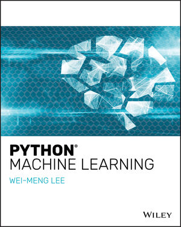

# Scíkit-Learn Library

This repository contains pytorch tutorials and practice files from the book
**Python Machine Learning** by *Wei-Meng Lee*.




The site for the book is: https://www.wiley.com/en-us/Python+Machine+Learning-p-9781119545637.
Link to original git repo: https://github.com/deep-learning-with-pytorch/dlwpt-code.


## Contents in the Repository
1. [About Python Machine Learning](#1-about-python-machine-learning)
2. [Requirements](#1-requirements)
3. [Installation](#2-installation)

## 1. About Python Machine Learning
Readers will get started by following fundamental topics such as an introduction to Machine Learning and Data Science. 
For each learning algorithm, readers will use a real-life scenario to show how Python is used to solve the problem at hand.

## 2. Requirements

* python 3.7.6
* Jupyter Notebook
* sklearn


## 3. Installation 

1. Install CUDA 10.1 and CUDNN 7.6.5
   
2. Install Jupyter Notebook:
   
   follow procedures as mentioned in: [here](https://jupyterlab.readthedocs.io/en/stable/getting_started/installation.html)

3. Create python virtual environment with Anaconda prompt.

   ```bash
   conda create --name skenv
   conda activate skenv
   ```
   
4. Install **sklearn** library for CUDA 10.1

    ```bash
    pip install sklearn 
    ```
5. AddPython environment to jupyter notebook:
   
   follow procedures as mentioned in: [here](https://janakiev.com/blog/jupyter-virtual-envs/)
   
   ```bash
   pip install --user ipykernel
   python -m ipykernel install --user --name=skenv
   ```

This should print the following:

Installed kernelspec myenv in /home/user/.local/share/jupyter/kernels/skenv
